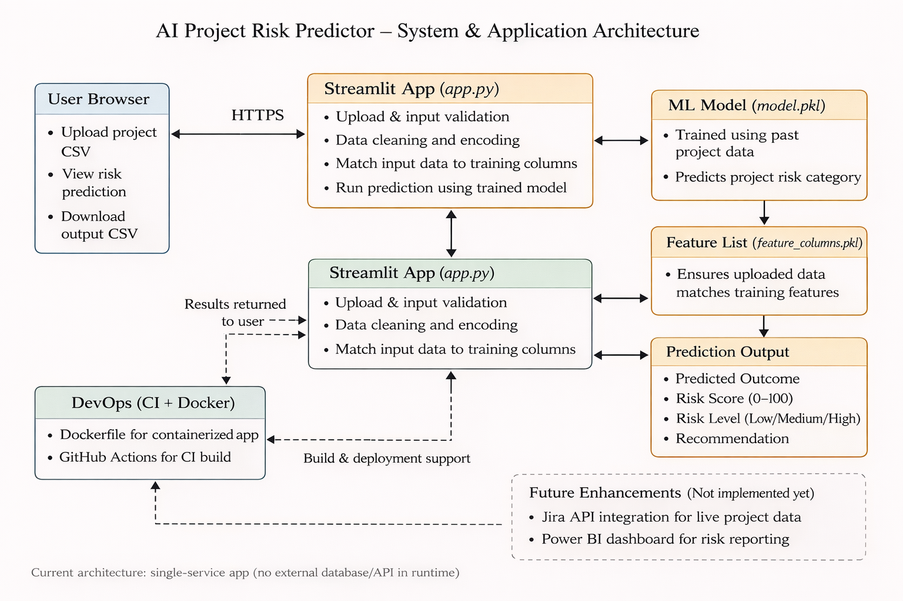

# Networking & System Architecture (AI Project Risk Predictor)

## System Architecture Diagram

## Networking & Communication Flow (Actual Implementation)

This project currently runs as a single-container application and uses a simple but realistic networking model suitable for early-stage AI products.

- The client (user browser) communicates with the application over HTTPS.
- The Streamlit server runs inside a Docker container and listens on a configurable port (default: 8501).
- All preprocessing, inference, and post-processing happen within the same container.
- Model artifacts (`model.pkl`, `feature_columns.pkl`) are loaded locally at runtime.
- No external API calls are made during inference.

This architecture was intentionally kept minimal to:
- Reduce latency
- Avoid unnecessary network hops
- Simplify deployment and CI validation

Future enhancements may include separating model inference into a dedicated service.

## 1. High-Level Goal
This project delivers an AI-driven risk prediction service through a web application. Users upload a project dataset (CSV), the system runs inference using a trained ML model, and returns:
- Predicted project outcome (e.g., On Track / Delayed / Critical)
- Risk score (0–100)
- Risk band (Low / Medium / High)
- Recommended action

---

## 2. Architecture Overview (Client–Server)
**Client (User Browser)**
- Users access the Streamlit web UI through HTTPS.
- Users upload a CSV and view/download prediction results.

**Server (Streamlit App)**
- Hosts the UI and Python inference logic (`app.py`).
- Loads `model.pkl` + `feature_columns.pkl`.
- Preprocesses uploaded CSV to match training feature space.
- Performs prediction and calculates risk score + band + actions.

**Artifacts / Storage**
- Model artifacts (`model.pkl`, `feature_columns.pkl`) are bundled with the application.
- Output results can be downloaded as CSV from the UI.

---

## 3. Network/Data Flow (End-to-End)
### Step-by-step flow
1. **DNS + HTTPS Access**
   - User opens the app URL (Streamlit Cloud or local host).
   - Browser establishes a secure HTTPS connection (TLS).

2. **Upload Request**
   - User uploads CSV via Streamlit UI.
   - File is transmitted to the server over HTTPS.

3. **Preprocessing (Server-Side)**
   - App reads CSV into pandas.
   - Applies one-hot encoding to categorical fields.
   - Adds any missing columns required by the trained model.
   - Aligns column ordering using `feature_columns.pkl`.

4. **Inference**
   - App runs `model.predict()` (and `predict_proba()` if supported).
   - Risk score is computed from probability outputs.

5. **Response Rendering**
   - Server sends results back to the client UI.
   - User can filter results and download CSV outputs.

---

## 4. Ports, Protocols, and Security Considerations
### Ports & Protocols
- **HTTPS (443)**: Standard web access when deployed on Streamlit Cloud.
- **HTTP (8501)**: Default Streamlit port for local Docker runs.

### Security
- HTTPS encrypts uploaded data in transit.
- No credentials are required for the current prototype.
- Recommended improvement for production:
  - Authentication (SSO/OAuth)
  - Role-based access control (RBAC)
  - Input validation + file size limits
  - Secure secret storage via environment variables

---

## 5. Deployment Networking (Docker + CI)
### Docker
- Docker exposes port **8501** and binds to **0.0.0.0** inside container.
- Local access example:
  - `http://localhost:8501`

### GitHub Actions (CI)
- CI validates that dependencies install correctly.
- CI verifies core files exist and Docker build succeeds.
- This reduces deployment failures caused by missing artifacts.

---

## 6. Scalability & Reliability (Future Enhancements)
For larger usage (multiple teams/projects):
- Add a backend API layer (FastAPI) behind a load balancer
- Store artifacts in an object store (S3/Blob)
- Add caching for repeated inferences
- Add monitoring: latency, error rate, drift detection

---

## 7. Suggested “Enterprise” Integration (Optional Roadmap)
- **Jira Integration**
  - Pull project metrics using Jira API instead of manual CSV uploads.
- **Data Warehouse Integration**
  - Store results in Snowflake / SQL database for historical tracking.
- **Power BI Integration**
  - Use exported prediction CSV as a reporting layer for stakeholders.

---
