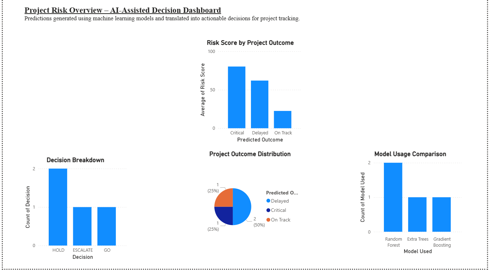
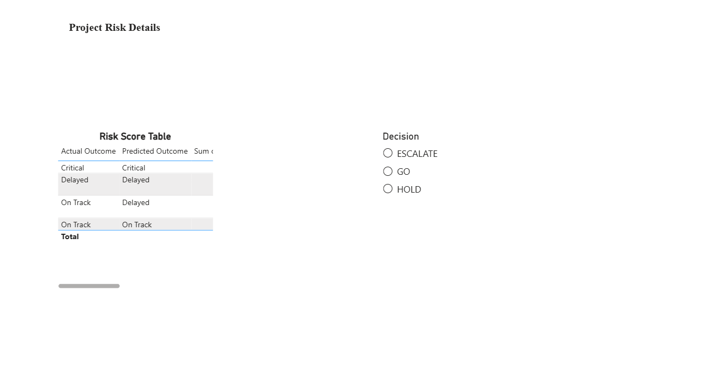

# Power BI Dashboard – Project Risk Monitoring

This Power BI dashboard was created to help understand project risk in a clear and practical way.  
It takes the output generated by the AI Project Risk Predictor and presents it in a format that is easy for managers and stakeholders to review.

The focus of this dashboard is decision support, not technical details.

---

## Dashboard Pages

### Overview

The Overview page provides a quick summary of overall project health.

It shows:
- How projects are distributed across different risk outcomes
- Average risk scores for each predicted outcome
- How many projects fall under each decision category (GO, HOLD, ESCALATE)
- Which models were used to generate predictions

This page is designed for leadership and project managers who want a fast understanding of where attention is needed.

---

### Details

The Details page is meant for closer inspection of individual projects.

It includes:
- Actual vs predicted project outcomes
- Risk scores for each project
- Recommended decisions
- A short explanation describing why a decision was suggested

A decision filter allows users to quickly focus only on projects that require escalation or closer monitoring.

---

## Data Source

The dashboard uses CSV files generated after applying business decision rules to machine learning predictions.  
These CSV files act as a clean interface between the technical system and reporting tools.

---

## Purpose

The purpose of this dashboard is to bridge the gap between AI-generated insights and real project management decisions.  
It allows non-technical users to review risks, understand recommendations, and take action without interacting directly with the underlying models.

## Dashboard Screenshots

### Overview Page
This page shows a high-level summary of project risk, predicted outcomes, and decision distribution for quick monitoring.

---

### Details Page
This page allows deeper analysis using filters and tables to review individual project predictions and recommended actions.

